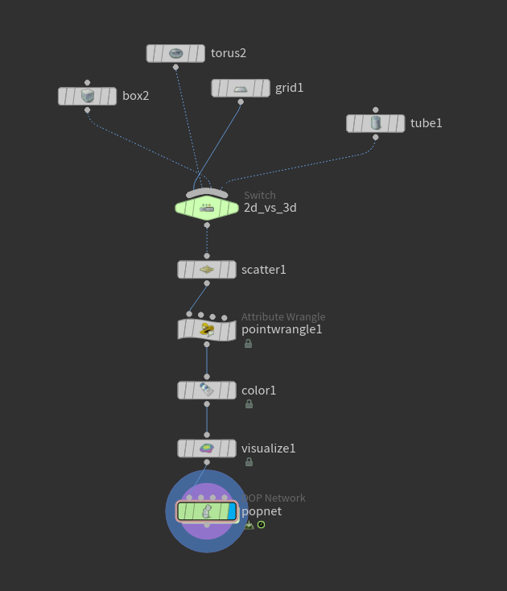
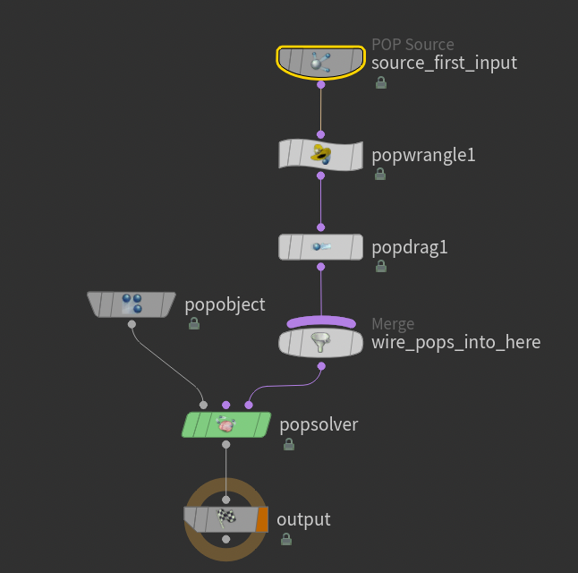

# Bitácora Actividad 05: Reto de Diseño – Una Contradicción en Movimiento

**Proyecto:** Abandonar el planeta tierra


**Herramienta:** Houdini

---

##  Intención y Contradicción

Quiero explorar la tension entre la necesidad de los recursos naturales y el sentimiento de exploracion.

Manifestacion en el sistema:
Las particulas crearan un planeta denso donde intentaran vivir. La contradiccion esta en que las particulas que buscan explorar se atraen al centro para alimentarse, pero se repelen entre si al estar muy cerca. Esto genera una presion interna que termina deformando el planeta y expulsando grupos de particulas en forma de gusanos o naves. Al salir de la zona de influencia de los recursos, pierden la fuerza de atraccion y quedan vagando solas en el espacio.

### Manifestación en el sistema
Las particulas crearan una especie de planeta tierra en el cual viviran hasta cierto punto, despues de cierto tiempo el sistema de particulas cambiara sus valores haciendo que unas particulas exploten y la mision de las que quedan en el planeta tierra sera intentar abandonar todo ese espacio donde estan las particulas repartidas, crearan una especie de gusano/nave con ellas mismas pero al abandonar la zona se quedaran sin recursos ni motivo por el cual seguir moviendose, quedando vagas en el espacio

---
### Nodos necesarios para el proyecto
Ok, empezamos con un switch el cual sera el que elija cual figura tomar encuenta, AUNQUE se pueden unir las figuras usando  otro nodo, para el ejercicio solo tome una sola figura por simulacion


principalmente queria ver que tal se comporta la simulacion con un objeto 3d, despues de esto va a p asar por un scatter el cual se encargara de hacer puntos por toda la figura y despues un wwrangle, este solo se encargara de darle un color distinto a cada punto con la linea de codigo 
```c
i@type = int(rint(rand(@ptnum)*3));
```
Despues solo estara el color, el cual con ayuda de la linea del codigo la podremos traer en el nodo color como un atributo y luego con el nodo visualize volveremos los puntos en esferas usando la ocpion points as sheres, esto con el proposito que se use pocos recursos en el sistema, asi que vamos a ver una visualizacion, no un calculo completo por ultimo vamos con un popnet, el cual sera el corazon de nuestra simulacion 



aqui por defecto ya tendremos algunso nodos por defecto, como el popsovler  o el pop sourve o el po object junto al wire pops, los unicos que crearemos es un wrangle y un popdrag, el pop drag adelanto que su principal objetivo sera dar fuerza de friccion, aqui dejo un ejemplo de como se veria nuestra simulacion sin este nodo

[Ver simulación en YouTube](https://www.youtube.com/watch?v=NYGN2Kl1xW0)

si lo se, se desbanece como galleta, bueno igualmente sigamos con el nodo wrangle donde va estar lo importante 

---

##  Código del Sistema (VEX)

Implementación del comportamiento en un **POP Wrangle** evaluando la matriz de interacción $4\times4$, la inversión por tiempo y el rango de fuerza suavizado por curva:

```c
matrix parms = ch4('Parameters');
float mindist = chf('Minimum_Distance');
float maxdist = chf('Maximum_Distance');
float force_scl = chf('Force_Scale');

float switch_time = chf('Switch_Tiempo'); 

// Disparador de cambio de matriz 
//if (@Time >= switch_time) {
//   parms *= -1.0; 
//}

int npts[] = nearpoints(0, v@P, maxdist, 100);
removevalue(npts, @ptnum);

vector aceleracion = {0,0,0};

```
Primero haremos los controladores de la simulaicon y asi tambien de una vez un condicional que haga que toda la matrix cambie despues de cierto tiempo, y crearemos una lista la cual nos ayudara a calcular los 100 puntos mas cercanos tomando en cuenta la posicion de cada pounto y tambien la maxima distancia, la idea es que no pase la maxima distancia dictada, y pondremos un vector de aceleracion en ceros,  Ya con eso listo, armamos el ciclo foreach para recorrer punto por punto a todos los vecinos que encontramos en la lista npts:
```c

foreach(int npt; npts){
    int ntype = point(0, "type", npt);
    vector npos = point(0, "P", npt);
    
    vector direccion = npos - v@P;
    float dist = length(direccion);
    
    // Repulsion de seguridad a  la corta distancia
    if(dist < mindist){
        direccion = normalize(direccion) * fit(dist, 0.0, mindist, -10.0, 0.0) * force_scl;
    }
```
Dentro del ciclo, lo primero es traer con el nodo point el tipo de partícula que es el vecino ntype y su posición en el espacio npos. Con eso calculamos el vector de dirección restando las posiciones (`npos - v@P`) y sacamos la distancia real entre los dos con la función length

Luego metemos el condicional para manejar las fuerzas según qué tan cerca estén:

Si la distancia es menor a la distancia mínima (`mindist`), significa que se están acercando o acumulando demasiado  entonces esto hace que que ignoremos la matriz y forzamos una repulsion directa usando un `fit` que va de -10.0 a 0.0, multiplicado por el vector de dirección normalizado y la escala de fuerza para que no se traslapen las partículas
```c

else{
        float ramppos = fit(dist, mindist, maxdist, 0.0, 1.0);
        direccion = normalize(direccion) * chramp('Shape', ramppos) * getcomp(parms, i@type, ntype) * force_scl;
    }
    
    aceleracion += direccion;
}

v@force += aceleracion;
```


Si estan a una distancia normal (osea entre mindist y maxdist), usamos el else. Mapeamos esa distancia de 0 a 1 en ramppos para pasársela a la curva de la rampa chramp('Shape'), y la multiplicamos por la matriz usando `getcomp(parms, i@type, ntype)`. Asi es como el programa sabe si mi tipo de particula se atrae o se repele con la del vecino segun el valor de la tabla 

Toda esa direccion calculada se la vamos sumando a la variable de aceleracion en cada vuelta del ciclo. Al salir del foreach, simplemente le sumamos la aceleracion acumulada a la fuerza global con v@force += aceleracion para que el POP Solver mueva las partículas en la simulacion


---


### Matriz de Relaciones 4x4 
Valores positivos representan atracción y valores negativos repulsión. Las filas indican la partícula que reacciona y las columnas el vecino que ejerce la fuerza).

| Desde \ Hacia | Tipo 0 (Amarillo) | Tipo 1 (Verde) | Tipo 2 (Azul) | Tipo 3 (Rojo) |
| :--- | :---: | :---: | :---: | :---: |
| **Tipo 0 (Amarillo)** | `4.0` | `2.0` | `0.0` | `0.0` |
| **Tipo 1 (Verde)** | `6.0` | `1.0` | `0.0` | `-3.0` |
| **Tipo 2 (Azul)** | `1.0` | `0.0` | `2.0` | `-6.0` |
| **Tipo 3 (Rojo)** | `1.0` | `0.0` | `-6.0` | `2.0` |

Justificacion de poblaciones y parametros:
cada tipo de particula esta dividido en mismas cantidades, esto con el proposito de tener un balance a la hora de hacer la simulacion y notar mas facil el comportamiento de todas
-Tipo 0 (Amarillo - 5000 particulas) 
-Tipo 1 (Verde - 5000 particulas)
-Tipo 2 (Azul - 5000 particulas)
-Tipo 3 (Rojo - 5000 particulas)

Parametros globales:
Distancia Maxima ($R_{max} = 0.711$): Seleccioné 0.711 porque quiero hacer perceptible el limite del espacio. Espero que cuando las particulas se alejen mas de esto, queden flotando sin interactuar.Distancia Minima ($R_{min} = 0.16$): Seleccioné 0.16 porque quiero hacer perceptible el volumen fisico. Espero que evite que todas las particulas colapsen en un solo punto.Friccion (0.08): Seleccioné 0.08 en el POP Drag porque quiero hacer perceptible un medio fluido. Espero que controle las velocidades brutas para que no salgan disparadas.


---
### Cambios y dificultades del proyecto

Este proyecto fue algo retador para mi, ya que aunque logre hacer el particle life en 3d, el resultado que tenia planeado tuve que hacer diferentes versiones y ajustar los numeros de la matrix a masomenos lo que queria que ocurriese.
Para mejorar el consumo de recursos de Houdini, descubri que el problema era que el nodo nearpoints() estaba buscando 100 vecinos en cada fotograma para cada particula. Para optimizarlo voy a bajar el limite a 40 o 50 vecinos maximo, y desactivare la visualizacion de esferas pesadas antes de simular para que no se me quede congelado 2 o 3 minutos cargando.

---


## Autoevaluación Sustentada

| Criterio | Peso | Valoracion (%) | Aporte | Evidencia / Sustento |
| :--- | :---: | :---: | :---: | :--- |
| **Intencion clara y perceptible** | 20% | 70% | 14.0% | Se evidencia en la tension entre el Tipo 1 y Tipo 3 visible en la rutina de movimiento y deformacion de la masa. |
| **Justificacion de parametros y matriz** | 25% | 80% | 20.0% | Cada valor de la matriz tiene un proposito documentado en la seccion de parametros de esta bitacora. |
| **Comprension tecnica del sistema** | 20% | 100% | 20.0% | Implementacion y control de posicion, velocidad, aceleracion y distancias en el codigo VEX dentro del POP Wrangle. |
| **Variaciones con identidad reconocible** | 15% | 90% | 13.5% | Distintas semillas generan patrones unicos pero con la misma firma de movimiento y dinamica de escape. |
| **Experimentacion y descartes** | 10% | 80% | 8.0% | Documentados los intentos fallidos de desvanecimiento por falta de friccion y el ajuste del POP Drag. |
| **Distincion entre lo diseñado y emergente** | 10% | 90% | 9.0% | Claridad entre las ecuaciones base en VEX y las estructuras de gusano/nave que se forman al intentar escapar. |
| **TOTAL** | **100%** | | **84.5%** | **Nota Propuesta: 4.2 / 5.0** |

---
