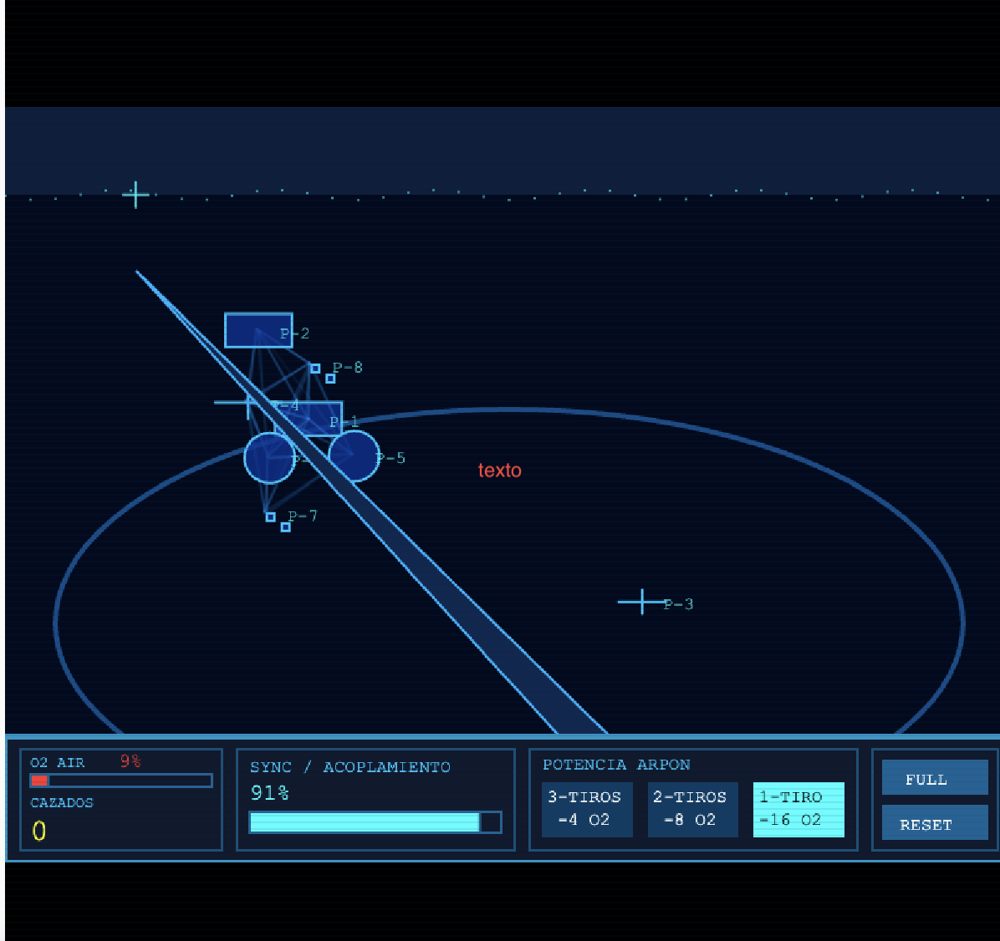
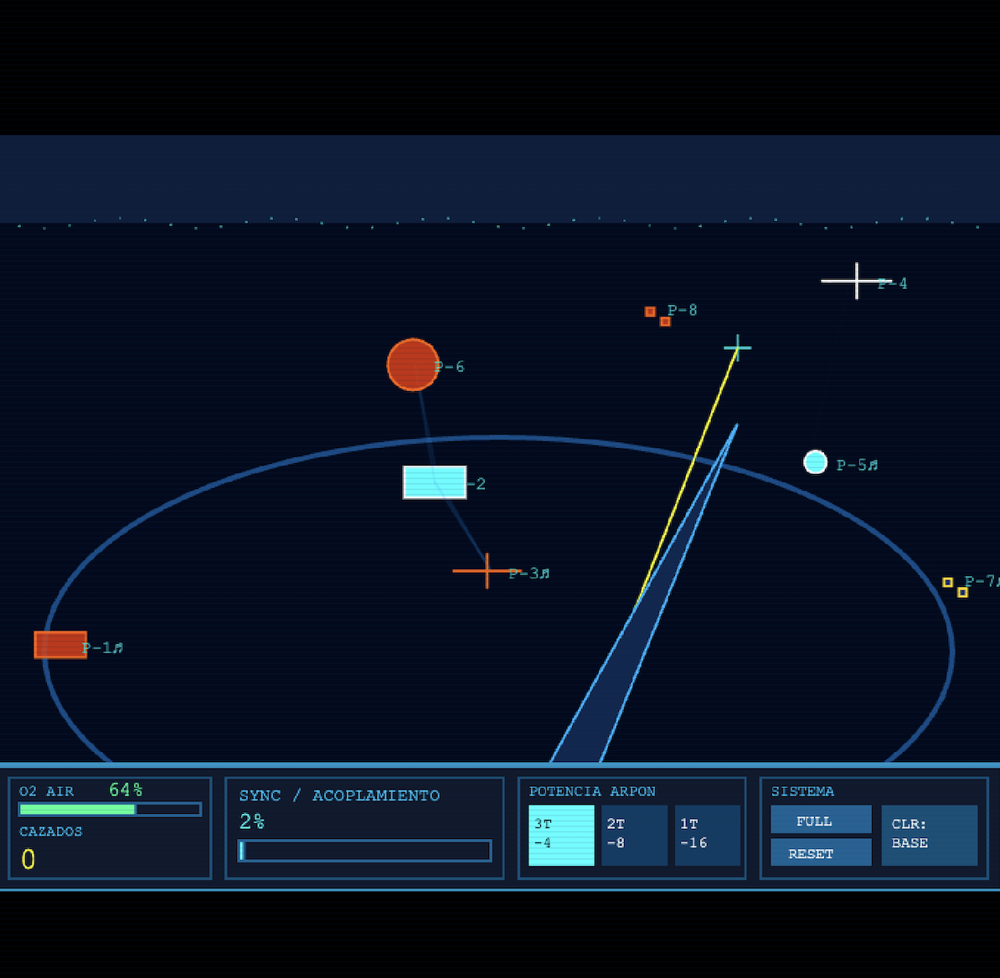
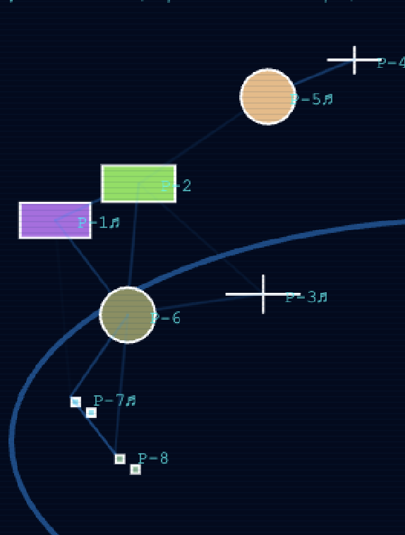
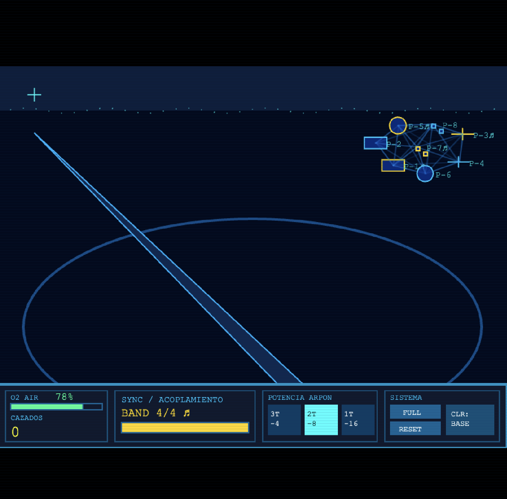

# Bitácora Unidad 4: Oscilación y Sincronía - Kuramoto Abisal

---

## Proyecto Funcional y Publicado

- **URL Pública:** [https://editor.p5js.org/mugsky/sketches/NWV-d32Ek](https://editor.p5js.org/mugsky/sketches/NWV-d32Ek)

- **Modo LAB / Visor HUD:** Pantalla interactiva en tiempo real con resolución nativa retro proyectada a viewport dinámico con CRT scanlines. Simula la interfaz del casco de buzo permitiendo monitorear el Faro de Sincronía/Acoplamiento (**SYNC %** / **BAND 4/4 ♫**), gestionar la reserva de Oxígeno (**O2 AIR**), seleccionar la potencia del arpón, alternar la paleta de color, contabilizar peces cazados (**CAZADOS**) y ejecutar la percusión o daño por disparo

---

## Referencia Estética y Mecánica

- **Concepto:** Minijuego de cacería táctico con perspectiva en primera persona inspirado en los clásicos del género como *Doom* y *Wolfenstein 3D*, trasladado a un entorno abisal retro. Se integra la simulación de cardumen mediante el modelo de Kuramoto y fuerzas de comportamiento de Flocking para recrear cómo los peces se agrupan, coordinan su nado y reaccionan al peligro

---

## Ficha del Modelo de Kuramoto y Mecánicas Integradas

### Ecuación General Utilizada
$$\frac{d\theta_i}{dt} = \omega_i + \frac{K}{N} \sum_{j=1}^{N} \sin(\theta_j - \theta_i)$$

- **$\theta_i$ (Fase del Pez $i$):** Representa la posición actual en el ciclo de oscilación y pulso bioluminiscente de cada pez.
- **$\omega_i$ (Frecuencia Natural):** Velocidad intrínseca de oscilación asignada individualmente mediante **random(0.02, 0.05)**.
- **$K$ (Fuerza de Acoplamiento):** Parámetro de cohesión rítmica del agua abisal. Aumenta con la inmovilidad del buzo y cae drásticamente ante disparos o desplazamientos.
- **$N$ (Vecinos Locales):** Cantidad de peces detectados dentro del radio de percepción menor a $70\text{px}$.
- **$\sin(\theta_j - \theta_i)$:** Término de acoplamiento no lineal que acelera o frena la oscilación del pez para sincronizar su fase con la del cardumen local.

### Parametrización Inicial y Variables de Cacería
- **K_base:** $0.02$, con recuperación progresiva hacia el acoplamiento en reposo hasta un límite de $0.45$.
- **radius_perception:** $70\text{px}$ para la red topológica local.
- **N_agents:** $8$ agentes en total. Son 4 peces sonoros con capas de audio MP3 individuales de Batería, Guitarra, Piano y Sintetizador, más 4 peces normales.
- **K_disruption:** $-0.25$ por disparo de arpón.
- **Detección Estricta de Grafo Sonoro (verificarCuatroSonorosConectados):** Algoritmo BFS que confirma si los 4 peces musicales forman un único componente conectado entre si sin depender de peces normales.
- **Toggle de Color Global (modoColorAleatorio):** Conmutador que permite alternar entre la paleta cian bioluminiscente base con aviso de daño en naranja y una paleta de colores RGB aleatorios asignada individualmente a cada pez.
- **Selector de Potencia del Arpón (3 Botones):**
  - *Modo 1 (3 Tiros):* Consumo de $-4\text{ O}_2$ | Daño $35\text{ HP}$.
  - *Modo 2 (2 Tiros):* Consumo de $-8\text{ O}_2$ | Daño $50\text{ HP}$.
  - *Modo 3 (1 Tiro):* Consumo de $-16\text{ O}_2$ | Daño $100\text{ HP}$.

---

## Registro de Pruebas y Comportamientos Emergentes

**1. Acoplamiento Nulo ($K \to 0$)**
* **Descripción:** Movimiento continuo del buzo o disparos constantes.
* **Comportamiento y Función en Código:** Desorden Total. Los peces oscilan a su frecuencia natural $\omega_i$, las conexiones de fase se rompen, la bioluminiscencia titila descoordinada y los audios en bucle se detienen. Esta prueba valida la lógica de perturbación en **draw()**, donde el movimiento del jugador o las llamadas a **recibirDano()** reducen el valor de $K$ a su punto mínimo **0.01**.

**2. Transición Progresiva en Reposo**
* **Descripción:** Ocurre cuando dejo al buzo quieto en el fondo sin moverme ni disparar.
* **Comportamiento y Función en Código:** El cardumen empieza a organizarse solo poco a poco. Al no hacer nada, la variable **kValue** va subiendo gradualmente hasta $0.45$. Los peces se van juntando en pequeños grupos rítmicos hasta que al final todos terminan nadando en perfecta sincronía. Esto lo controla la aceleración de cohesión y alineamiento dentro de **PezAbisal.update()**.

**3. Perturbación por Disparo y Daño**
* **Descripción:** Disparo de arpón directo a un pez dentro del cardumen.
* **Comportamiento y Función en Código:** El pez impactado entra en pánico, cambia a color naranja, apaga su audio y sale disparado huyendo junto a los demás peces cercanos. Esta prueba demuestra la ejecución del método **asustarsePorDisparo()** y **recibirDano()**, aplicando una fuerza de repulsión inmediata y un bajón drástico de $K$ con un **K_disruption** de $-0.25$.

**4. Alternancia de Paleta Visual (Modo RGB)**
* **Descripción:** Activación del botón de color en la interfaz del HUD.
* **Comportamiento y Función en Código:** Le asigna colores totalmente aleatorios a cada pez para cambiar la estética del juego al instante. Esta prueba valida la variable global **modoColorAleatorio** y la función **generarNuevoColor()** dentro de **PezAbisal**, cambiando la paleta visual sin romper la simulación matemática de Kuramoto ni la física del nado

**5. Estilo Sonoro y Ensamble Polifónico**
* **Descripción:** Interacción y sincronización con los 4 peces sonoros del mapa.
* **Comportamiento y Función en Código:** Cada pez especial tiene asignado un instrumento diferente entre Batería, Guitarra, Piano y Sintetizador que puede sonar individualmente al pasar el mouse sobre el. Sin embargo, cuando los 4 peces sonoros se unen en el agua, sus audios en bucle se activan al mismo tiempo para formar una sola melodía completa. Esto se logra mediante la función **verificarCuatroSonorosConectados()**, la cual ejecuta un algoritmo BFS en tiempo real para verificar que los 4 estén interconectados.

---

## Score y Experiencia Performativa

| Estado del Sistema | Intención Auditiva / Visual | Acciones del Performer |
| :--- | :--- | :--- |
| **Fase 1: Calma y Acoplamiento** | Cohesión rítmica armónica, pulso bioluminiscente coordinado, líneas de red estables y activación de audios MP3 en bucle (**BAND 4/4 ♫**). | Dejar al buzo en reposo en el lecho marino para que el indicador de **SYNC** alcance su valor máximo y los 4 peces sonoros se unan. |
| **Fase 2: Personalización Visual** | Modificación en vivo de la estética del entorno sin alterar la física del juego. | Presionar el botón **CLR** para conmutar entre la visión térmico/bioluminiscente tradicional o el espectro de color aleatorio RGB. |
| **Fase 3: Gestión Táctica y Disparo** | Decisión estratégica entre gasto de oxígeno y velocidad de neutralización. | Seleccionar entre los modos P1, P2 o P3 según el aire disponible, apuntar al cardumen con la mira reticular y disparar. |
| **Fase 4: Asfixia y Emergencia** | Caída crítica de reserva de aire cuando la reserva es menor al 25%, alerta visual roja en la StatusBar. | Mantener pulsada la tecla **ESPACIO** para ascender rápidamente a la superficie y recargar oxígeno antes del **GAME OVER**. |

---

## Bitácora de Uso y Criterio frente a IA

| Prompt / Consulta a IA | Sugerencia Recibida de la IA | Decisión y Corrección Aplicada | Razón de la Decisión |
| :--- | :--- | :--- | :--- |
| *"¿Cómo hacer que la sincronización de Kuramoto active sonidos en p5.js?"* | Disparar sonidos en cada frame dentro del loop **draw()** usando sintetizadores externos o condicionales de fase. | **Rechazada.** Se utilizó **p5.SoundFile** con archivos MP3 reproducidos en bucle bajo estados de acoplamiento local o global o mediante **checkHover()**. | Disparar muestras de audio en cada frame de dibujo saturaba el buffer de audio y bloqueaba la ejecución del canvas. |
| *"Modificar la variable K de Kuramoto mediante un reloj automático."* | Crear un **setInterval** que cambie $K$ de 0 a 1 cada 5 segundos. | **Rechazada.** Se ató la variación de $K$ a la acción directa del usuario mediante movimiento y disparos. | La guía exige expresamente que el sistema sea performativo y no una animación predeterminada. |
| *"Crear un botón toggle para alternar entre colores aleatorios y la figura base."* | Usar botones HTML externos o regenerar todo el array de peces desde cero. | **Modificada.** Se integró la variable **modoColorAleatorio** y un método **generarNuevoColor()** dentro de cada objeto **PezAbisal**, controlado por un botón nativo en el buffer del HUD. | Evita reinstanciar la simulación de Kuramoto, manteniendo vivas las fases y la física sin tirones de rendimiento. |
| *"Detectar si los 4 peces especiales están conectados comprobando solo sus vecinos."* | Usar la propiedad **tieneVecinosAlineados** individual de cada pez sonoro. | **Rechazada y Corregida.** Se implementó un recorrido BFS exclusivo para el subgrupo de peces sonoros. | La propiedad genérica permitía que un pez especial contara como conectado al apoyarse en un pez común no sonoro. |

---

## Autoevaluación Ponderada

| Criterio | Peso | Justificación de Cumplimiento | Valoración | Aporte |
| :--- | :---: | :--- | :---: | :---: |
| **Requisitos Mínimos Cumplidos** | 25% | 8 agentes móviles con capas sonoras MP3 individuales, $K$ dinámico en tiempo real, HUD con 3 botones de potencia de arpón, medidor de $O_2$, acoplamiento **SYNC**, marcador de bajas y botón de alternancia de color. | 100% | 25.0% |
| **Explicación de Variables del Modelo** | 25% | Documentación matemática y aplicada de $\theta_i$, $\omega_i$, $K$, $N$ y $\sin(\theta_j - \theta_i)$ adaptados al comportamiento de los peces abisales. | 100% | 25.0% |
| **Explicación del Comportamiento Emergente** | 25% | Análisis de cómo las fluctuaciones de $K$ por reposo o disparos generan transiciones entre caos, cardúmenes locales y sincronía global. | 100% | 25.0% |
| **Demostración de Objetivos de la Unidad** | 25% | Integración de Kuramoto y Flocking dentro de una experiencia de minijuego FPS interactiva, expresiva y performativa. | 100% | 25.0% |
| **TOTAL PUNTOS** | **100%** | | | **100.0%** |

**Nota Propuesta:** 5.0 / 5.0
