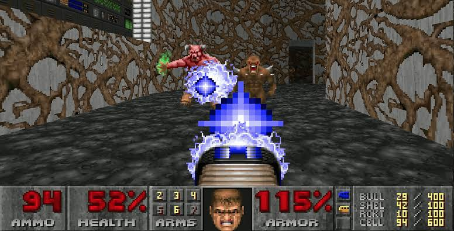
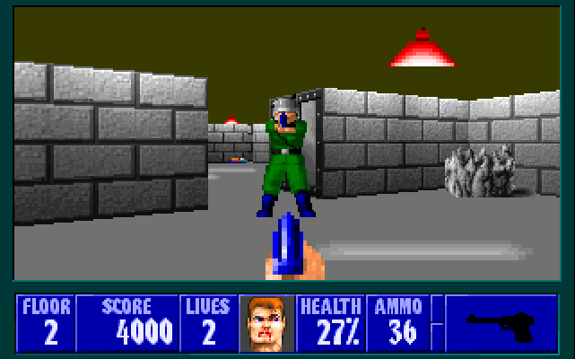

# Bitácora Unidad 4: Oscilación y Sincronía - Kuramoto Abisal

---

## Proyecto Funcional y Publicado

- **URL Pública:** [https://editor.p5js.org/mugsky/sketches/NWV-d32Ek](https://editor.p5js.org/mugsky/sketches/NWV-d32Ek)

- **Modo LAB / Visor HUD:** Pantalla interactiva en tiempo real con resolucion nativa retro (400x300 proyectada a viewport dinamico con CRT scanlines). Simula la interfaz del casco de buzo permitiendo monitorear el Faro de Sincronia/Acoplamiento (`SYNC %`), gestionar la reserva de Oxigeno (`O2 AIR`), seleccionar la potencia del arpon (3 modos), alternar la paleta de color (`CLR: BASE` / `CLR: RGB`), contabilizar peces cazados (`CAZADOS`) y ejecutar la percusion/daño por disparo.

---

## Referencia Estetica y Mecanica

- **Concepto:** Minijuego de caceria tactico con perspectiva en primera persona (FPS) inspirado en los clasicos del genero (*Doom*, *Wolfenstein 3D*), trasladado a un entorno abisal retro. Se integra la simulacion de cardumen mediante el modelo de Kuramoto y fuerzas de comportamiento de Flocking (cohesion, alineamiento, separacion) para recrear como los peces se agrupan, coordinan su nado y reaccionan al peligro.

---

## Ficha del Modelo de Kuramoto y Mecanicas Integradas

### Ecuacion General Utilizada
$$\frac{d\theta_i}{dt} = \omega_i + \frac{K}{N} \sum_{j=1}^{N} \sin(\theta_j - \theta_i)$$

- **$\theta_i$ (Fase del Pez $i$):** Representa la posicion actual en el ciclo de oscilacion y pulso bioluminiscente de cada pez.
- **$\omega_i$ (Frecuencia Natural):** Velocidad intrinseca de oscilacion asignada individualmente (`random(0.02, 0.05)`).
- **$K$ (Fuerza de Acoplamiento):** Parametro de cohesion ritmica del agua abisal. Aumenta con la inmovilidad del buzo y cae drasticamente ante disparos o desplazamientos.
- **$N$ (Vecinos Locales):** Cantidad de peces detectados dentro del radio de percepcion ($<70\text{px}$).
- **$\sin(\theta_j - \theta_i)$:** Termino de acoplamiento no lineal que acelera o frena la oscilacion del pez para sincronizar su fase con la del cardumen local.

### Parametrizacion Inicial y Variables de Caceria
- `K_base`: $0.02$ (recuperacion progresiva hacia el acoplamiento en reposo).
- `radius_perception`: $70\text{px}$ (red topologica local).
- `N_agents`: $8$ agentes con identidades sonoras unicas (escala de 8 notas en Tone.js).
- `K_disruption`: $-0.08$ por disparo de arpon.
- **Toggle de Color Global (`modoColorAleatorio`):** Conmutador que permite alternar entre la paleta cian bioluminiscente base (con aviso de daño en naranja) y una paleta de colores RGB aleatorios asignada individualmente a cada pez.
- **Selector de Potencia del Arpon (3 Botones):**
  - *Modo 1 (3 Tiros):* Consumo de $-4\text{ O}_2$ | Daño $35\text{ HP}$.
  - *Modo 2 (2 Tiros):* Consumo de $-8\text{ O}_2$ | Daño $50\text{ HP}$.
  - *Modo 3 (1 Tiro):* Consumo de $-16\text{ O}_2$ | Daño $100\text{ HP}$.

---

## Registro de Pruebas y Comportamientos Emergentes

| Prueba | Configuracion y Entorno | Resultado Observado |
| :--- | :--- | :--- |
| **1. Acoplamiento Nulo ($K \to 0$)** | Movimiento continuo del buzo o disparos constantes. | **Desorden Total.** Los peces oscilan a su frecuencia natural $\omega_i$, las conexiones de fase se rompen y la bioluminiscencia titila descoordinada. |
| **2. Transicion Progresiva (Reposo)** | Buzo estatico en el fondo ($Y = 220$) sin disparar. | **Organizacion Emergente.** $K$ incrementa gradualmente ($0\% \to 100\%$). Nacen clusteres ritmicos locales que contagian al grupo entero hasta nadar en unisono armonico. |
| **3. Perturbacion por Disparo y Daño** | Disparo de arpon sobre un pez del cardumen. | **Desagregacion y Panico.** $K$ se desploma. El pez impactado pierde vida, cambia a tono naranja (en modo base), activa su nota musical en Tone.js y acelera abruptamente. |
| **4. Alternancia de Paleta Visual** | Clic sobre el boton `CLR` en el modulo SISTEMA del HUD. | **Conmutacion de Identidad.** El sistema cambia dinamicamente de `CLR: BASE` a `CLR: RGB`, generando tonos aleatorios unicos para cada pez sin romper la simulacion de Kuramoto ni la sincro de audio. |
| **5. Eliminacion y Respawn** | Reducir la vida de un pez a $0\text{ HP}$. | **Contador de Bajas e Insercion.** Se incrementa la metrica `CAZADOS` en el HUD y el pez reaparece por los bordes del mapa con salud y color regenerados. |

---

## Score y Experiencia Performativa

| Estado del Sistema | Intencion Auditiva / Visual | Acciones del Performer |
| :--- | :--- | :--- |
| **Fase 1: Calma y Acoplamiento** | Cohesion ritmica armonica, pulso bioluminiscente coordinado y lineas de red estables. | Dejar al buzo en reposo en el lecho marino para que el indicador de `SYNC` alcance su valor maximo. |
| **Fase 2: Personalizacion Visual** | Modificacion en vivo de la estetica del entorno sin alterar la fisica del juego. | Presionar el boton `CLR` para conmutar entre la vision termico/bioluminiscente tradicional o el espectro de color aleatorio RGB. |
| **Fase 3: Gestion Tactica y Disparo** | Decision estrategica entre gasto de oxigeno y velocidad de neutralizacion. | Seleccionar entre los modos P1, P2 o P3 segun el aire disponible, apuntar al cardumen con la mira reticular y disparar. |
| **Fase 4: Asfixia y Emergencia** | Caida critica de reserva de aire ($O_2 < 25\%$), alerta visual roja en la StatusBar. | Mantener pulsada la tecla `ESPACIO` para ascender rapidamente a la superficie y recargar oxigeno antes del `GAME OVER`. |

---

## Bitacora de Uso y Criterio frente a IA

| Prompt / Consulta a IA | Sugerencia Recibida de la IA | Decision y Correccion Aplicada | Razon de la Decision |
| :--- | :--- | :--- | :--- |
| *"¿Como hacer que la sincronizacion de Kuramoto active sonidos en p5.js?"* | Disparar sonidos en cada frame dentro del loop `draw()` usando condicionales de fase. | **Rechazada.** Se implemento un evento discreto al recibir impacto e interactuar con sintetizadores polifonicos en Tone.js. | Disparar audio en cada frame saturaba el buffer de audio y bloqueaba la ejecucion del canvas. |
| *"Modificar la variable K de Kuramoto mediante un reloj automatico."* | Crear un `setInterval` que cambie $K$ de 0 a 1 cada 5 segundos. | **Rechazada.** Se ato la variacion de $K$ a la accion directa del usuario (movimiento y disparos). | La guia exige expresamente que el sistema sea performativo y no una animacion predeterminada. |
| *"Crear un boton toggle para alternar entre colores aleatorios y la figura base."* | Usar botones HTML externos o regenerar todo el array de peces desde cero. | **Modificada.** Se integro la variable `modoColorAleatorio` y un metodo `generarNuevoColor()` dentro de cada objeto `PezAbisal`, controlado por un boton nativo en el buffer del HUD. | Evita reinstanciar la simulacion de Kuramoto, manteniendo vivas las fases y la fisica sin tirones de rendimiento. |

---

## Autoevaluacion Ponderada

| Criterio | Peso | Justificacion de Cumplimiento | Valoracion | Aporte |
| :--- | :---: | :--- | :---: | :---: |
| **Requisitos Minimos Cumplidos** | 25% | 8 agentes moviles con sintesis sonora individual, $K$ dinamico en tiempo real, HUD con 3 botones de potencia de arpon, medidor de $O_2$, acoplamiento `SYNC`, marcador de bajas y boton de alternancia de color. | 100% | 25.0% |
| **Explicacion de Variables del Modelo** | 25% | Documentacion matematica y aplicada de $\theta_i$, $\omega_i$, $K$, $N$ y $\sin(\theta_j - \theta_i)$ adaptados al comportamiento de los peces abisales. | 100% | 25.0% |
| **Explicacion del Comportamiento Emergente** | 25% | Analisis de como las fluctuaciones de $K$ (por reposo o disparos) generan transiciones entre caos, cardumenes locales y sincronia global. | 100% | 25.0% |
| **Demostracion de Objetivos de la Unidad** | 25% | Integracion de Kuramoto y Flocking dentro de una experiencia de minijuego FPS interactiva, expresiva y performativa. | 100% | 25.0% |
| **TOTAL PUNTOS** | **100%** | | | **100.0%** |

**Nota Propuesta:** 5.0 / 5.0
